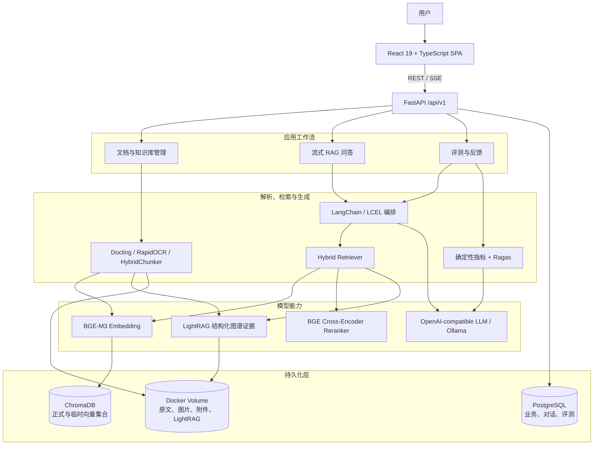

# ExploreRAG 系统架构

本文描述 ExploreRAG 当前实现的系统边界、模块职责、数据存储和关键设计约束。项目采用固定的 LangChain/LCEL RAG 流程，不是能够自行规划和调用任意工具的通用 Agent。

相关文档：

- [RAG 摄取、检索与流式问答](RAG_PIPELINE.md)
- [Docker 与本地开发部署](DEPLOYMENT.md)
- [配置参考](CONFIGURATION.md)
- [数据、备份与恢复](DATA_AND_BACKUP.md)
- [故障排查](TROUBLESHOOTING.md)

## 系统架构总览

`/api/v1` 是 HTTP API 的版本前缀，不是 FastAPI 的版本。前端通过普通 REST 管理知识库、文档和评测，通过 SSE 接收长时间运行的流式问答事件。

## 架构风格

ExploreRAG 是前后端分离、容器化部署的模块化单体：

- 前端由 React/Vite 构建，Compose 容器内由 Nginx 提供静态资源并代理 `/api`、`/static` 和 SSE。
- 后端是一个 FastAPI 进程，默认运行单个 Uvicorn worker。
- LangChain/LCEL 负责把范围解析、检索、附件上下文和回答链组合成固定流程。
- PostgreSQL、ChromaDB 和 LightRAG 文件存储分别承担业务状态、向量索引和图谱索引。
- BGE-M3、Reranker 与 Ollama 共享本地 GPU 时，由进程内门控串行协调显存使用。

单 worker 是当前资源调度正确性的组成部分。若改为多个后端 worker，进程内队列、模型缓存和 GPU 门控不会跨进程共享，需要迁移到 Redis、Celery 或其他跨进程调度方案。

## 模块职责

| 模块 | 责任 | 主要入口 |
|---|---|---|
| HTTP API | 请求校验、资源查找、状态码、SSE 转换 | [`backend/app/api`](../backend/app/api) |
| LangChain RAG | 检索链、回答链、领域事件和流式编排 | [`backend/app/langchain_rag`](../backend/app/langchain_rag) |
| 文档服务 | 上传、解析、切分、去重、Embedding 与发布 | [`explore_rag_service.py`](../backend/app/services/explore_rag_service.py) |
| 检索服务 | 向量召回、重排、图谱证据、图片与表格关联 | [`deep_retriever.py`](../backend/app/services/deep_retriever.py) |
| 临时附件 | 校验、异步准备、直接上下文或临时索引、清理 | [`attachment_processor.py`](../backend/app/services/attachment_processor.py) |
| 知识图谱 | LightRAG 摄取、结构化证据、图谱浏览与删除 | [`knowledge_graph_service.py`](../backend/app/services/knowledge_graph_service.py) |
| 资源调度 | 为 Docling、Embedding、Reranker 和 LLM 增强排队 | [`work_scheduler.py`](../backend/app/services/work_scheduler.py) |
| 数据模型 | 知识库、文档、对话、附件和评测记录 | [`backend/app/models`](../backend/app/models) |
| 评测 | 数据集、运行、指标、Ragas 和实验指纹 | [`backend/app/evaluation`](../backend/app/evaluation) |
| 前端 | 页面、流式 Hook、数据面板、图谱和评测 UI | [`frontend/src`](../frontend/src) |

## 数据权威来源

| 数据 | 权威来源 | 派生数据 |
|---|---|---|
| 知识库配置、文档状态和业务元数据 | PostgreSQL | Chroma 扁平元数据、LightRAG 索引配置 |
| 文档原文 | `explorerag_uploads` Volume | Markdown、图片、表格、向量分块、图谱事实 |
| 正式向量索引 | Chroma `kb_<workspace_id>` | 可删除并从原文重新构建 |
| 知识图谱 | `backend/data/lightrag/kb_<workspace_id>` | 可从文档 Markdown 重新构建 |
| 对话与反馈 | PostgreSQL `chat_messages` | 前端历史记录与回归案例草稿 |
| 临时附件 | PostgreSQL 附件记录 + `backend/data/chat-attachments` | Chroma `tmp_chat_ws_<workspace_id>`，清空对话时删除 |
| 评测案例、运行和结果 | PostgreSQL | 导出的 Markdown/JSON 报告 |

PostgreSQL、Chroma 和文件卷不共享事务。系统通过状态机、可见性字段和清理重试减少跨存储不一致，但备份时仍必须把它们视为一个数据集合，详见 [数据、备份与恢复](DATA_AND_BACKUP.md)。

## 核心设计约束

### 工作区隔离

- 每个知识库对应一个 PostgreSQL `knowledge_bases.id`。
- 正式向量集合命名为 `kb_<workspace_id>`。
- LightRAG 工作目录命名为 `data/lightrag/kb_<workspace_id>`。
- Docling 图片位于 `data/docling/kb_<workspace_id>`。
- 临时附件使用独立的 `tmp_chat_ws_<workspace_id>` 集合，不写入正式知识库或图谱。

### 先写入、后发布

文档向量先以不可检索状态写入 Chroma。只有向量索引和启用的图谱摄取都成功后，向量才变为可检索，PostgreSQL 文档才标记为已索引。失败时删除未发布向量并记录错误。

### 范围安全优先

Chroma 可以按文档 ID 和业务元数据精确过滤；当前 LightRAG 查询以整个工作区为范围。查询限定文档或元数据时，检索策略会关闭图谱分支，避免混入范围外证据。`vector_only` 只表示不使用图谱证据，Reranker 仍可执行。

### 证据而非指令

检索材料会作为不可信证据放入回答 Prompt。模型被要求忽略文档中的角色声明、工具指令和“覆盖系统提示”等内容，并使用系统生成的来源 ID 引用证据。这是降低 Prompt Injection 风险的边界，不是绝对安全保证。

### 可降级检索

- LightRAG 查询失败或超时时，继续使用向量证据。
- Reranker 超时、熔断或不可用时，保留向量排序。
- 本地 LLM 模式不会静默回退到云端。
- 文档处理超时后，重启时会把长期停留在处理中状态的文档标记为失败，允许重新分析。

## 启动与关闭生命周期

后端启动时依次执行：

1. 校验配置为 CUDA 的本地检索模型是否能访问 GPU。
2. 首次安装根据 `schema.sql` 初始化 PostgreSQL，随后执行 Alembic 升级。
3. 恢复超时的文档处理状态和中断的评测运行。
4. 按配置预热 BGE-M3，并在启用时预热 Reranker。

关闭时清理 LightRAG 服务缓存并释放数据库连接池。容器重启不会删除 PostgreSQL、Chroma、上传文件或 RAG 工作目录。

## 关键实现入口

- [FastAPI 应用与生命周期](../backend/app/main.py)
- [API 路由汇总](../backend/app/api/router.py)
- [LangChain 对话服务](../backend/app/langchain_rag/service.py)
- [检索链](../backend/app/langchain_rag/chains/retrieval.py)
- [回答链](../backend/app/langchain_rag/chains/answer.py)
- [文档入库编排](../backend/app/services/explore_rag_service.py)
- [检索策略](../backend/app/services/retrieval_policy.py)
- [Docker Compose](../docker-compose.yml)
