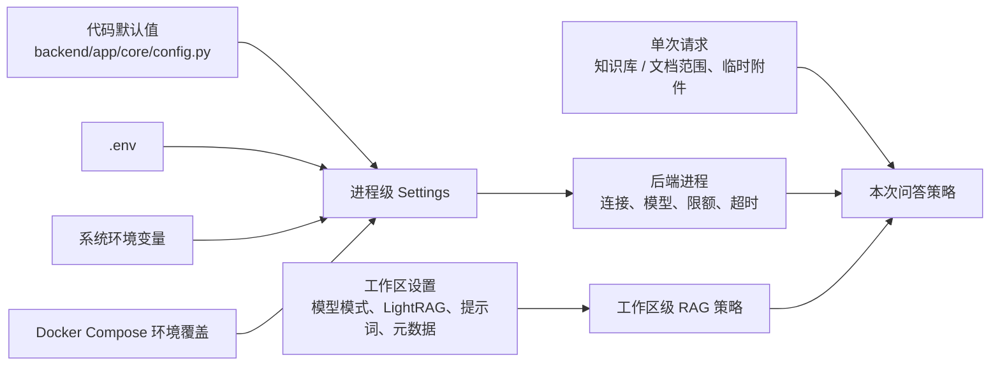

# 配置参考

ExploreRAG 的配置分为三层：进程环境变量控制服务和模型运行方式，工作区设置控制单个知识库的检索行为，请求参数控制一次问答的临时范围。理解这三层可以避免“改了 `.env` 但界面没有变化”或“只想限制本次查询却重建了整个索引”。

相关文档：

- [部署与运行](./DEPLOYMENT.md)
- [RAG 流程](./RAG_PIPELINE.md)
- [数据与备份](./DATA_AND_BACKUP.md)
- [故障排查](./TROUBLESHOOTING.md)

## 配置来源与优先级



同名进程配置遵循 Pydantic Settings 的覆盖关系：系统/容器环境变量高于 `.env`，`.env` 高于代码默认值。完整 Compose 还会把数据库与 Chroma 主机覆盖为容器服务名；本地开发则使用 `localhost`。

配置对象在后端进程中缓存，因此修改 `.env` 后需要重启 backend。

## 最小配置

从模板创建本地配置：

```powershell
Copy-Item .env.example .env
```

### 云端模型

至少配置一个 provider：

```dotenv
LLM_PROVIDER=dashscope
DASHSCOPE_API_KEY=replace-me
DASHSCOPE_BASE_URL=https://dashscope.aliyuncs.com/compatible-mode/v1
LLM_MODEL_FAST=qwen-plus
```

或：

```dotenv
LLM_PROVIDER=deepseek
DEEPSEEK_API_KEY=replace-me
DEEPSEEK_BASE_URL=https://api.deepseek.com/v1
LLM_MODEL_FAST=deepseek-chat
```

### 本地模型

工作区选择本地模式后，文本生成通过 Ollama：

```dotenv
LOCAL_LLM_BASE_URL=http://localhost:11434/v1
LOCAL_LLM_NATIVE_BASE_URL=http://localhost:11434
LOCAL_LLM_MODEL=qwen3-vl:4b-instruct
LOCAL_LLM_VISION_MODEL=qwen3-vl:4b-instruct
LOCAL_LLM_CONTEXT_WINDOW=8192
LOCAL_LLM_MAX_OUTPUT_TOKENS=2048
```

完整 Compose 中上述 URL 应指向容器服务 `ollama`；Compose 文件已提供相应覆盖。

## 进程级配置

以下表格列出最影响行为的变量。完整字段、类型和默认值以 `backend/app/core/config.py` 为准，推荐值与示例以 `.env.example` 为准。

### 服务与存储

| 变量 | 作用 | 修改注意 |
| --- | --- | --- |
| `DATABASE_URL` | PostgreSQL 连接 | 本地与容器主机名不同 |
| `CHROMA_HOST` / `CHROMA_PORT` | Chroma 连接 | 与已有索引版本保持兼容 |
| `CORS_ORIGINS` | 允许的前端来源 | 公网环境不要使用宽泛来源 |
| `AUTO_CREATE_TABLES` | 首次启动兼容建表 | 正式升级仍以 Alembic 为准 |
| `EXPLORERAG_PROCESSING_TIMEOUT_MINUTES` | 启动时识别陈旧任务 | 超时任务会被恢复为失败状态 |

API 路由当前由后端以 `/api/v1` 挂载；它表示接口版本前缀，不是额外服务。

### 生成模型

| 变量组 | 作用 |
| --- | --- |
| `LLM_PROVIDER`、`DASHSCOPE_*`、`DEEPSEEK_*` | 云端 OpenAI-compatible 模型连接 |
| `LLM_MODEL_FAST`、最大输出 token 与超时 | 默认问答模型及生成限制 |
| `LOCAL_LLM_*` | 本地文本/视觉模型、上下文和并发限制 |
| `EVALUATION_LLM_*` | RAG 评测裁判模型、输出和重试限制 |

API key 只能放在 `.env` 或外部密钥系统中，不要写入 README、截图、前端代码或提交记录。

### Embedding 与 Reranker

| 变量组 | 作用 | 典型影响 |
| --- | --- | --- |
| `EXPLORERAG_EMBEDDING_PROVIDER`、`EXPLORERAG_EMBEDDING_MODEL`、`EXPLORERAG_EMBEDDING_DEVICE` | 主向量索引模型 | 模型或维度变化需要重建 Chroma 索引 |
| `KG_EMBEDDING_*` | LightRAG 图谱实体与片段 embedding | 变化后需要重建对应图谱数据 |
| `EXPLORERAG_RERANKER_MODEL`、device、dtype | 二阶段重排模型 | 重启生效，不必重建向量 |
| `EXPLORERAG_RERANKER_MAX_LENGTH`、batch、timeout、熔断参数 | 控制效果、显存和延迟 | 过高可能触发 OOM 或超时降级 |

### 检索与知识图谱

| 变量组 | 作用 |
| --- | --- |
| `EXPLORERAG_KB_PREFETCH`、`EXPLORERAG_KB_RERANK_TOP_K`、`EXPLORERAG_MIN_RELEVANCE_SCORE` | 向量召回数量、最终数量与最低相关度 |
| `EXPLORERAG_ENABLE_KG` | 服务级 LightRAG 能力总开关 |
| `EXPLORERAG_KG_AUGMENTATION_*` | 图谱检索超时、证据长度和 top-k |
| `EXPLORERAG_KG_CHUNK_TOKEN_SIZE`、KG embedding batch/并发/超时 | 图谱入库切分与吞吐 |
| `EXPLORERAG_KG_LANGUAGE`、`EXPLORERAG_KG_ENTITY_TYPES`、默认 query mode | 图谱抽取语言、实体类型和检索模式 |

工作区仍可单独关闭 LightRAG。服务级开关为关闭时，工作区设置无法强制开启它。

### 文档解析与切分

| 变量组 | 作用 |
| --- | --- |
| `EXPLORERAG_DOCLING_ARTIFACTS_PATH` | Docling 离线模型目录 |
| `EXPLORERAG_DOCLING_IMAGES_SCALE` | 页面与图片渲染比例 |
| 图片/表格描述、图片提取、公式 enrichment 开关 | 控制多模态解析深度 |
| `EXPLORERAG_CHUNK_MAX_TOKENS`、embedding max tokens、overlap | 正式知识库切分与 embedding 输入 |
| `EXPLORERAG_DEDUP_*` | 文档内近似重复片段消除 |

解析和切分参数只影响新处理的文档。若希望历史文档使用新规则，需要重新索引。

### 临时附件

附件变量覆盖文件数、单文件大小、PDF 页数、ZIP 条目/解压体积/压缩比、图片像素、最多片段、上下文预算、预取和重排数量、视觉页数、扫描判断以及处理超时。

这些限制同时承担资源保护和压缩炸弹防护职责。放宽 ZIP、图片像素或并发限制前应先评估内存、磁盘和显存峰值。

## Docker Compose 专用变量

以下变量用于 Compose 在宿主机定位模型目录，不属于后端 Settings：

| 变量 | 用途 |
| --- | --- |
| `POSTGRES_USER` / `POSTGRES_PASSWORD` / `POSTGRES_DB` | PostgreSQL 初始化凭据；密码必填且不得提交 |
| `DATABASE_URL_DOCKER` | backend 在 Compose 内的完整数据库 URL，密码需 URL 编码 |
| `EXPLORERAG_HTTP_BIND_ADDRESS` / `EXPLORERAG_HTTP_PORT` | Web 入口绑定；默认 `127.0.0.1:5500` |
| `POSTGRES_DEV_PORT` / `CHROMA_DEV_PORT` | 本地开发服务端口，只绑定回环地址 |
| `BGE_M3_MODEL_DIR` | 主 embedding 模型只读挂载 |
| `BGE_RERANKER_MODEL_DIR` | Reranker 模型只读挂载 |
| `DOCLING_MODELS_DIR` | Docling artifacts 只读挂载 |

容器内模型路径由 Compose 固定或通过对应容器内变量配置。路径不存在、权限不足或挂载为空时，后端预热/启动会失败。

## 工作区级配置

工作区设置保存在 PostgreSQL，主要包括：

- `cloud` / `local` 模型模式。
- 是否启用 LightRAG 增强。
- 知识图谱语言和实体类型。
- 工作区系统提示词。
- 元数据 schema 及字段定义。

这些设置只影响当前 workspace，不需要修改 `.env`。元数据字段若参与检索过滤或语义表达，变更后可能需要重建文档索引。

## 单次请求配置

一次问答可以选择知识库、限定文档、附加临时文件，并启用或关闭当次可选能力。只要存在知识库/文档范围限制，检索策略就会使用 `vector_only` 以保证不会从工作区级知识图谱带入范围外材料；Reranker 仍可对范围内候选进行重排。详见 [RetrievalPolicy](./RAG_PIPELINE.md#retrievalpolicy)。

## 配置变更影响

| 变更 | 重启 backend | 重建 Chroma | 重建 LightRAG | 重新解析原文 |
| --- | :---: | :---: | :---: | :---: |
| API key、生成模型、超时 | 是 | 否 | 否 | 否 |
| Reranker 模型或参数 | 是 | 否 | 否 | 否 |
| 主 embedding 模型或维度 | 是 | 是 | 视 KG embedding 是否同时变化 | 否 |
| KG embedding、语言、实体类型 | 是 | 否 | 是 | 通常否 |
| top-k、最低相关度 | 是 | 否 | 否 | 否 |
| 文档切分或去重策略 | 是 | 是 | 建议同步 | 否 |
| Docling 解析、图片/表格/公式 enrichment | 是 | 是 | 建议同步 | 是 |
| 工作区提示词、当次查询范围 | 否 | 否 | 否 | 否 |

不要在没有备份时直接删除索引卷。索引迁移与恢复见[数据与备份](./DATA_AND_BACKUP.md)。
