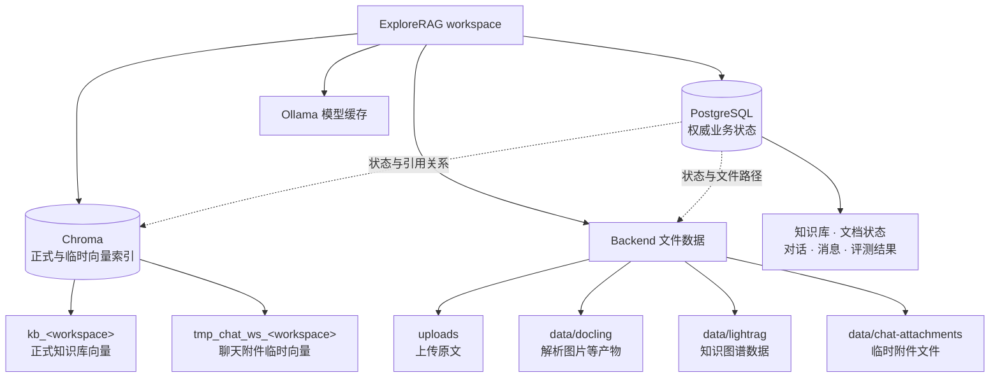

# 数据、生命周期与备份

ExploreRAG 不是“只有一个数据库”的应用。业务状态、向量索引、知识图谱和文件分别持久化；可靠恢复需要把它们视为一个有版本关系的数据集。

相关文档：

- [系统架构](./ARCHITECTURE.md)
- [部署与运行](./DEPLOYMENT.md)
- [配置参考](./CONFIGURATION.md)
- [故障排查](./TROUBLESHOOTING.md)

## 数据归属



### 持久化清单

| 数据 | Docker 位置 | 是否权威 | 能否重建 |
| --- | --- | --- | --- |
| 业务元数据、文档状态、消息、评测 | `explorerag_postgres_data` | 是 | 通常不能从索引完整反推 |
| 正式/临时向量索引 | `explorerag_chroma_data` | 派生索引 | 正式索引可从原文重新处理；临时附件通常随聊天清理 |
| 上传原文 | `explorerag_uploads` | 是 | 没有原文件副本时不能重建 |
| Docling、LightRAG、附件文件 | `explorerag_data` | 混合 | Docling/KG 多数可重建；临时附件依赖会话生命周期 |
| Ollama 模型 | `explorerag_ollama_data` | 缓存 | 可按模型名重新拉取 |
| `.env` | 宿主机文件 | 配置/密钥 | 应在安全密钥存储中另行备份，不放入数据归档 |

本地开发模式中，后端文件通常直接位于 `backend/uploads` 和 `backend/data`，而不是 named volumes。

## 一致性规则

- PostgreSQL 是文档状态和业务关系的权威来源。
- Chroma 中的新片段先不可见，文档必需处理完成后才发布为可检索；因此查询不会消费半成品索引。
- LightRAG 是可选增强分支，失败不应阻止向量检索发布。
- PostgreSQL 记录、Chroma collection 和文件数据通过 workspace/document 标识关联，备份时应尽量取自同一时间点。
- embedding 模型/维度、切分策略和 KG 配置属于索引的隐含版本。恢复到不同配置后可能需要重建。

## 备份范围

最低可恢复集合：

1. PostgreSQL 逻辑备份。
2. Chroma 持久化目录。
3. backend uploads 卷。
4. backend data 卷。
5. 版本信息：Git commit、Docker 镜像标签以及一份已脱敏的配置清单。

Ollama 卷可选；不备份会增加重新拉取模型的时间。`.env` 含密钥，应通过密码管理器或受控密钥系统独立保存。

## 备份步骤

下面的示例从项目根目录运行，并写入明确的 `backups` 目录。首先创建目录：

```powershell
New-Item -ItemType Directory -Force .\backups | Out-Null
```

### 1. 暂停写入

```powershell
docker compose stop frontend backend
```

保持 PostgreSQL 运行以执行逻辑导出。暂停 backend 可以避免文档发布、聊天附件或评测在备份过程中继续写入。

### 2. 导出 PostgreSQL

```powershell
docker compose exec postgres sh -c 'pg_dump -U "$POSTGRES_USER" -d "$POSTGRES_DB" -Fc -f /tmp/explorerag.dump'
docker cp explorerag-postgres:/tmp/explorerag.dump .\backups\explorerag-postgres.dump
```

使用容器内文件再 `docker cp`，可以避免 PowerShell 对二进制重定向的兼容问题。

### 3. 归档 Chroma

先停止 Chroma，确保其持久化目录不再变化：

```powershell
docker compose stop chromadb
docker run --rm --volumes-from explorerag-chromadb -v "${PWD}/backups:/backup" alpine sh -c "tar czf /backup/explorerag-chroma.tgz -C /chroma/chroma ."
```

### 4. 归档后端文件

```powershell
docker run --rm --volumes-from explorerag-backend -v "${PWD}/backups:/backup" alpine sh -c "tar czf /backup/explorerag-uploads.tgz -C /app/backend/uploads . && tar czf /backup/explorerag-data.tgz -C /app/backend/data ."
```

如果还要保留 Ollama 缓存：

```powershell
docker compose stop ollama
docker run --rm --volumes-from explorerag-ollama -v "${PWD}/backups:/backup" alpine sh -c "tar czf /backup/explorerag-ollama.tgz -C /root/.ollama ."
```

### 5. 保存版本清单并恢复服务

```powershell
git rev-parse HEAD | Set-Content .\backups\git-commit.txt
docker compose images | Out-File .\backups\docker-images.txt
Get-FileHash .\backups\* | Format-Table | Out-File .\backups\sha256.txt
docker compose up -d
docker compose ps
```

不要把原始 `.env` 复制到普通备份目录或上传到 Issue。可以另存一份不含 key/password 的变量名与非敏感值清单。

## 恢复原则

> 恢复会覆盖目标环境的数据。先确认目标项目、容器名称、备份日期与版本，并先备份目标现状。不要在仍有用户写入时恢复。

建议在与备份相同的 Git commit 和镜像版本上恢复，再执行升级。恢复顺序：

1. 停止 frontend/backend/chromadb，保留 PostgreSQL 供恢复命令使用。
2. 恢复 PostgreSQL 逻辑备份。
3. 将 Chroma、uploads 和 backend data 归档恢复到各自明确的数据卷。
4. 启动依赖与 backend，让 Alembic 检查/升级 schema。
5. 验证 `/ready`、文档数量、已有对话和至少一次带引用检索。

PostgreSQL 示例（仅用于已确认的空目标数据库）：

```powershell
docker cp .\backups\explorerag-postgres.dump explorerag-postgres:/tmp/explorerag.dump
docker compose exec postgres sh -c 'pg_restore -U "$POSTGRES_USER" -d "$POSTGRES_DB" --clean --if-exists /tmp/explorerag.dump'
```

`--clean` 会删除并重建备份中对象，属于破坏性操作。卷归档同样会覆盖目标文件，具体恢复命令应根据当前 Compose 路径和备份内容确认后执行，不建议复制一条未经核对的通用删除命令。

## 缺少部分备份时

| 可用数据 | 处理方式 |
| --- | --- |
| PostgreSQL + 原文存在，Chroma 丢失 | 重建 workspace 的向量索引 |
| PostgreSQL + 原文存在，LightRAG 丢失 | 向量问答可继续；需要时重建 KG |
| PostgreSQL 存在，原文和索引都丢失 | 业务记录仍在，但无法可靠恢复文档内容 |
| Chroma 存在，PostgreSQL 丢失 | 不应把孤立向量视作完整业务恢复 |
| Ollama 卷丢失 | 按配置的模型名称重新拉取 |

重建索引前确认 embedding 模型与维度；如果恢复的 Chroma 与当前配置不一致，应基于原文重建，而不是混合写入旧 collection。

## 删除生命周期

- 删除文档会尝试清理正式向量、上传文件和业务记录；可选外部清理失败会记录日志。
- 删除 workspace 会清理其正式 Chroma collection、LightRAG 与 Docling 数据，并删除数据库中的关联对象。
- 清空聊天会取消相关附件任务，并清理临时 collection、附件文件和消息关系。
- 容器重建不会自动删除 named volumes；`docker compose down -v` 会删除整个项目卷。

外部存储清理和数据库事务无法组成单一原子事务，因此异常中断后可能出现孤立文件或索引。先通过日志和标识确认对象归属，再做定向清理；不要使用全局 volume 删除作为常规维护手段。

## 备份验证

没有验证过的备份不能算完成。至少定期执行：

- 校验归档哈希并确认文件大小非零。
- 在隔离环境恢复，而不是覆盖唯一正式副本。
- 对比 workspace、知识库、文档和消息数量。
- 打开一个历史对话。
- 对一个已索引文档提问，确认回答包含可解析引用。
- 检查 Chroma 维度、LightRAG 可选分支与当前模型配置兼容。
