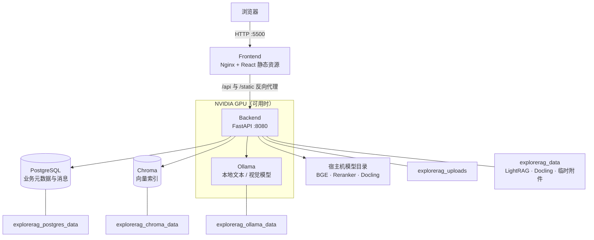

# 部署与运行

本文说明 ExploreRAG 的两种本地运行方式、Docker 拓扑、启动检查和升级边界。首次使用建议采用完整 Docker Compose；需要调试代码时再使用“基础服务容器 + 本地前后端”。该拓扑是单机单用户工作台，不包含企业公网部署所需的身份与租户边界。

相关文档：

- [系统架构](./ARCHITECTURE.md)
- [配置参考](./CONFIGURATION.md)
- [故障排查](./TROUBLESHOOTING.md)
- [数据与备份](./DATA_AND_BACKUP.md)

## 部署方式

| 方式 | 适用场景 | 入口 | 数据位置 |
| --- | --- | --- | --- |
| 完整 Docker Compose | 演示、日常使用、环境复现 | `http://localhost:5500` | Docker named volumes |
| 基础服务容器 + 本地应用 | 前后端开发、断点调试 | 前端开发服务器与后端 `:8080` | PostgreSQL/Chroma 在容器，本地目录保存应用文件 |

## Docker 部署拓扑



`frontend` 只提供静态页面并代理请求；真正持久化的数据位于 PostgreSQL、Chroma 以及后端的 uploads/data 卷。Ollama 模型卷可以重新拉取，但保留它能减少恢复时间。

## 完整 Docker Compose

### 前置条件

- Docker Desktop，Windows 环境需要启用 WSL 2 后端。
- 使用本地推理、Docling CUDA 或 GPU embedding 时，需要 NVIDIA 驱动与 Docker GPU 支持。
- 默认本机端口 `5500` 未被占用；其他服务只在 Compose 内部网络可见。
- 至少准备一个可用的云端模型 API，或先在 Ollama 中拉取本地模型。

先验证容器能够看到 GPU：

```powershell
docker run --rm --gpus all nvidia/cuda:12.4.1-base-ubuntu22.04 nvidia-smi
```

### 配置

```powershell
Copy-Item .env.example .env
```

编辑 `.env`，至少完成以下一类配置：

- 数据库：设置强 `POSTGRES_PASSWORD`，并在 `DATABASE_URL_DOCKER` 中使用同一密码的 URL 编码形式。
- 云端模式：填写 `DASHSCOPE_API_KEY` 或 `DEEPSEEK_API_KEY`，并选择对应 provider。
- 本地模式：确保 Ollama 可用，并设置 `LOCAL_LLM_MODEL` 与 `LOCAL_LLM_VISION_MODEL`。
- 本地模型目录：为 Compose 配置 BGE-M3、Reranker 和 Docling artifacts 的宿主机目录。

完整变量与重建索引影响见[配置参考](./CONFIGURATION.md)。`.env` 含密钥且已被 Git 忽略，不应提交到仓库。

### 构建和启动

```powershell
docker compose up -d --build
docker compose ps
```

首次启动会创建表并执行 Alembic 迁移，模型预热可能使后端就绪时间变长。查看实时日志：

```powershell
docker compose logs -f backend
```

### 验证

| 检查 | 地址或命令 | 预期结果 |
| --- | --- | --- |
| 前端 | `http://localhost:5500` | 页面正常打开 |
| 存活检查 | `docker compose exec backend curl -f http://localhost:8080/health` | 后端进程存活 |
| 就绪检查 | `docker compose exec backend curl -f http://localhost:8080/ready` | 依赖检查通过 |
| OpenAPI | 如需直连，仅在本地调试时显式映射 backend 端口 | FastAPI 接口页 |
| 容器状态 | `docker compose ps` | 关键服务 running/healthy |

### 停止和重启

```powershell
docker compose stop
docker compose start
```

`docker compose down` 会删除容器和网络，但默认保留 named volumes。`docker compose down -v` 会删除 PostgreSQL、Chroma、Ollama 和应用数据卷，属于不可逆的数据清理命令；不要把它当作普通重启命令使用。

## 本地开发模式

仅启动 PostgreSQL 与 Chroma：

```powershell
docker compose -f docker-compose.services.yml up -d
```

后端：

```powershell
Set-Location backend
python -m venv .venv
.\.venv\Scripts\Activate.ps1
pip install -r requirements.txt
alembic upgrade head
uvicorn app.main:app --host 127.0.0.1 --port 8080 --reload
```

前端：

```powershell
Set-Location frontend
npm install
npm run dev
```

此模式下，`.env` 中 `DATABASE_URL` 使用 `localhost:5433`，Chroma 使用 `localhost:8002`；两个开发端口都只绑定 `127.0.0.1`。完整 Compose 通过 `DATABASE_URL_DOCKER` 和服务名 `postgres`、`chromadb` 通信，不要把两套主机名混用。

## 升级

升级前先执行[一致性备份](./DATA_AND_BACKUP.md#备份步骤)，然后：

```powershell
git pull --ff-only
docker compose pull
docker compose up -d --build
docker compose ps
```

后端启动时会执行数据库迁移。升级后至少验证 `/ready`、创建一个测试对话，并从已有知识库完成一次带引用回答。若 embedding 模型、维度、切分策略或知识图谱配置发生变化，应按[配置变更影响](./CONFIGURATION.md#配置变更影响)重建对应索引。

## 运行边界

- 当前 Compose 面向本机单用户，应用本身没有完整的账号、RBAC 和租户认证层。
- 默认只把 Web 入口绑定到 `127.0.0.1:5500`，PostgreSQL、Chroma、Ollama 和 backend 仅在内部网络可见。公网或共享网络部署不在当前项目支持边界内。
- 后端使用单个 Uvicorn worker。任务调度器、资源队列和 GPU 门控都在进程内；直接增加 worker 会形成多套互不协调的内存队列。
- Compose 锁定了 PostgreSQL、Chroma 和 Ollama 镜像版本；升级前需先备份并重跑就绪与问答验证。
- `vmmemWSL` 表示整个 WSL 2 虚拟机的资源占用，可能同时包含 Docker、模型缓存和文件缓存。诊断方法见[故障排查](./TROUBLESHOOTING.md#vmmemwsl-内存占用较高)。
