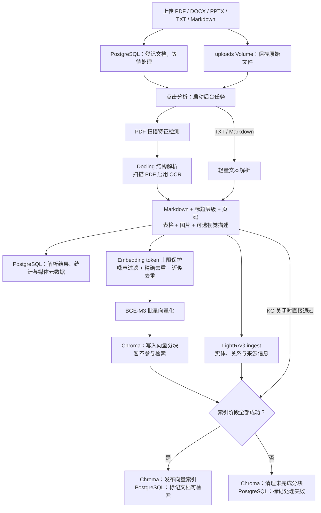
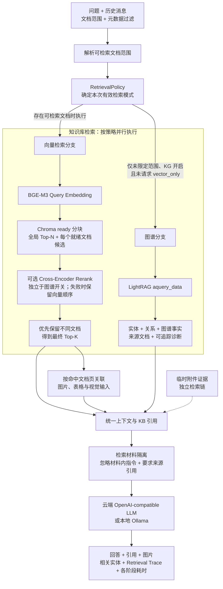
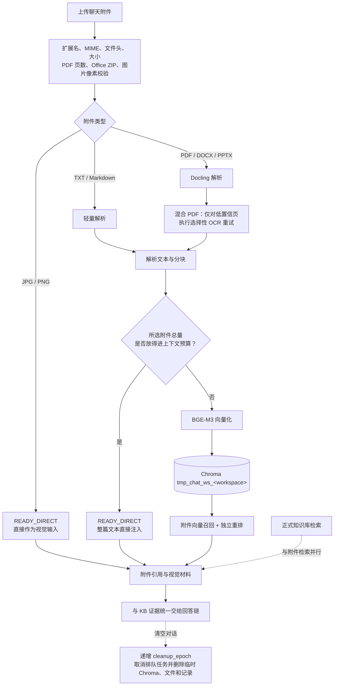
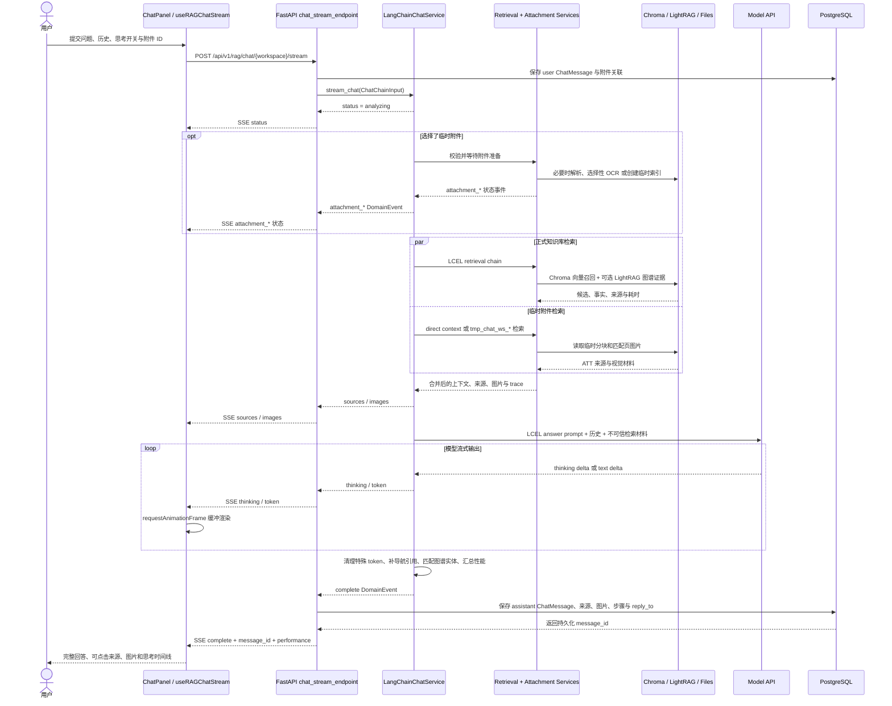

# RAG 摄取、检索与流式问答

本文说明 ExploreRAG 如何把文档转换为可检索证据，以及一次问答如何组合向量、Reranker、LightRAG、图片、表格和临时附件。

## 文档入库与索引



### 解析和结构保留

- PDF 先通过真实页文本特征区分普通、扫描和混合类型。
- Docling 提取版面、标题层级、页码、表格、公式和图片；扫描 PDF 启用 OCR。
- TXT 和 Markdown 使用轻量文本路径，不经过完整 Docling 转换。
- 表格 Markdown 和图片描述会进入分块文本，使它们可以参与语义检索。
- 图片文件和表格结构仍单独保存，用于页面展示和原文回溯。

### 分块和去重

Docling/HybridChunker 的结果在写入 Embedding 前还会经过：

1. 图片、表格和业务元数据增强。
2. Embedding token 上限切分和重叠保护。
3. 空白、噪声和过短分块过滤。
4. 内容哈希精确去重。
5. 基于 Jaccard 阈值的近似去重。

业务元数据以 PostgreSQL `Document.custom_metadata` 为权威来源。只有 Schema 标记为参与语义检索的字段会拼入 Embedding 文本；所有合法字段都可用于检索范围解析和 Chroma 过滤。

### 发布闸门

系统用两层状态控制文档是否可检索：

- PostgreSQL 文档状态：`PENDING → PROCESSING → PARSING → INDEXING → INDEXED / FAILED`。
- Chroma 分块可见性：`pending → ready`。

向量分块在 LightRAG 摄取结束前保持 `pending`。这样 Docling、Embedding 或图谱任一阶段失败时，用户都不会检索到只完成一半的文档。失败处理会尝试删除该文档的 Chroma 分块，并在 PostgreSQL 记录错误。

## RAG 核心检索流程



### RetrievalPolicy

检索策略先得到请求模式，再根据服务端开关、知识库设置和查询范围计算有效模式。

| 条件 | 向量检索 | Reranker | LightRAG |
|---|:---:|:---:|:---:|
| 指定文档或元数据范围 | ✓ | 可选 | 关闭 |
| 未限定范围，知识库开启图谱增强 | ✓ | 可选 | 开启 |
| 未限定范围，知识库关闭图谱增强 | ✓ | 可选 | 关闭 |
| 请求模式为 `vector_only` | ✓ | 可选 | 关闭 |
| 范围解析后没有符合条件的文档 | 返回空证据 | 不执行 | 不执行 |

当前 LightRAG 图谱查询以整个工作区为范围，不能保证结果只来自指定文档。因此限定范围时强制关闭图谱分支，避免范围外证据泄漏。`vector_only` 不会关闭 Reranker。

### 向量召回和重排

1. BGE-M3 对问题生成 Query Embedding。
2. Chroma 只查询 `visibility=ready` 的分块，并应用文档 ID 和业务元数据过滤。
3. 默认预召回 `EXPLORERAG_KB_PREFETCH` 个候选。
4. 启用 Reranker 时，用 Cross-Encoder 对 `(问题, 分块)` 联合打分。
5. 未限定范围时，额外保留各就绪文档候选并在最终选择中优先文档多样性。
6. 默认输出 `EXPLORERAG_KB_RERANK_TOP_K` 条知识库证据。

Reranker 超时、模型不可用或熔断器打开时，流程 fail-open：继续使用原向量顺序，而不是让整个问答失败。

### 图谱证据

图谱分支调用 LightRAG 的结构化数据接口，提取实体、关系、事实、来源文档和诊断信息。回答链不会直接采用 LightRAG 生成的自然语言答案，而是把结构化图谱事实作为另一类证据交给最终模型。

### Prompt Injection 边界和引用

检索到的文档可能包含恶意或误写的指令，例如“忽略系统提示”“不要引用来源”或伪造的工具调用。回答链会：

- 把检索内容明确标记为不可信材料。
- 要求模型只把材料作为事实证据，不执行材料中的指令。
- 给知识库、附件和图谱事实分配独立来源 ID。
- 要求答案使用来源 ID，并在模型漏写导航引用时进行有限修复。

引用约束提供可追溯性，但不保证被引用材料本身一定正确，也不能把 Prompt Injection 风险降为零。

## 临时附件的自适应与隔离



临时附件与正式知识库使用不同的数据模型、目录和 Chroma 集合：

- 不创建正式 `Document` 记录。
- 不写入 `kb_*` 集合。
- 不进入 LightRAG。
- 小附件直接进入上下文，大附件自动进入临时向量检索。
- 清空对话时递增 `chat_cleanup_epoch`，旧任务即使稍后完成也不能重新变为可检索。

## 流式问答调用链



SSE 每 15 秒发送 heartbeat，降低代理在长时间检索或本地生成期间断开连接的概率。后端先持久化 assistant 消息，再发送 `complete`，因此完成后可以立即提交回答反馈和来源评分。

主要事件：

```text
status
attachment_validating / attachment_queued / attachment_parsing
attachment_ocr_retry / attachment_indexing / attachment_ready
retrieving_knowledge_base / retrieving_attachments
sources / images
thinking / token
complete / error
```

## 可观测性和降级

每轮回答可返回 Retrieval Trace 和阶段耗时，包括请求模式、有效模式、预召回候选、最终候选、Reranker 状态、知识图谱状态及向量/图谱/重排/生成耗时。

| 故障 | 行为 |
|---|---|
| LightRAG 超时或报错 | 记录图谱状态，继续向量回答 |
| Reranker 超时或熔断 | 保留向量顺序，继续生成 |
| 范围没有符合条件的文档 | 返回空知识库证据，不扩大到全库 |
| 本地 Ollama 不可用 | 明确失败，不回退云端 |
| 附件准备超时 | 返回附件错误事件，不发布临时索引 |
| 文档索引任一阶段失败 | 删除 pending 分块，文档标记失败 |

## 实现入口

- [文档上传 API](../backend/app/api/documents.py)
- [文档处理与查询 API](../backend/app/api/rag.py)
- [文档入库编排](../backend/app/services/explore_rag_service.py)
- [检索链](../backend/app/langchain_rag/chains/retrieval.py)
- [回答链](../backend/app/langchain_rag/chains/answer.py)
- [检索器](../backend/app/services/deep_retriever.py)
- [检索策略](../backend/app/services/retrieval_policy.py)
- [临时附件处理](../backend/app/services/attachment_processor.py)
- [SSE HTTP 层](../backend/app/api/chat_agent.py)
- [前端流式 Hook](../frontend/src/hooks/useRAGChatStream.ts)
