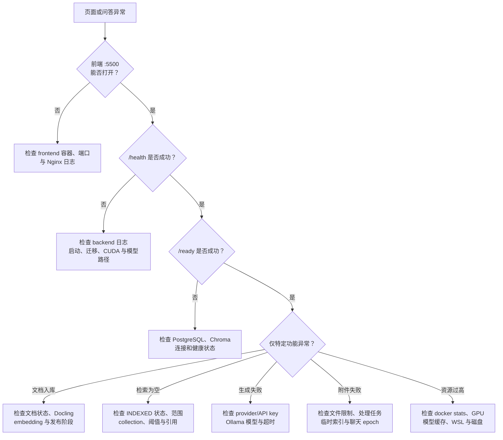

# 故障排查

本文按“入口 → 依赖 → 模型 → 数据流水线”的顺序排查 ExploreRAG。除非已经完成备份，不要通过删除 volume 解决启动或索引问题。

相关文档：

- [部署与运行](./DEPLOYMENT.md)
- [配置参考](./CONFIGURATION.md)
- [RAG 流程](./RAG_PIPELINE.md)
- [数据与备份](./DATA_AND_BACKUP.md)

## 先做五项检查

在项目根目录执行：

```powershell
docker compose ps
docker compose logs --tail 200 backend
docker compose exec backend curl -f http://localhost:8080/health
docker compose exec backend curl -f http://localhost:8080/ready
docker stats --no-stream
```

如果使用 GPU，再检查：

```powershell
nvidia-smi
docker exec explorerag-backend nvidia-smi
docker exec explorerag-ollama nvidia-smi
```

`/health` 只说明后端进程存活，`/ready` 才用于确认必要依赖是否就绪。排查时优先保留完整错误、发生时间、文档/工作区 ID 和当前配置名称，但不要复制 API key。

## 诊断路径



## 服务无法启动

### PostgreSQL 或 Chroma 未就绪

症状通常包括连接被拒绝、`/ready` 失败、后端反复重启。

```powershell
docker compose ps postgres chromadb
docker compose logs --tail 200 postgres chromadb
```

确认完整 Compose 中后端连接的是 `postgres` 与 `chromadb` 服务名；本地后端连接的通常是 `localhost:5433` 与 `localhost:8002`。端口正确但主机名使用了另一种运行方式时，同样会连接失败。

### 数据库迁移失败

先保留错误日志并备份 PostgreSQL。检查迁移版本：

```powershell
docker compose exec backend alembic current
docker compose exec backend alembic heads
```

不要手工删除表来“绕过”迁移。版本不一致时，应根据具体 Alembic 错误修复迁移链或恢复匹配版本的数据备份。

### CUDA 或本地模型路径失败

后端会校验配置为本地的模型能否使用 CUDA；模型只读挂载目录为空、驱动不兼容或容器没有 GPU 权限时，可能在启动/预热阶段失败。

检查：

- `docker exec explorerag-backend nvidia-smi` 是否成功。
- `.env` 中宿主机模型目录是否存在且包含完整模型文件。
- Compose 的只读挂载目标是否与 `config.py`/`.env` 中容器路径一致。
- 后端日志中是否出现 `CUDA unavailable`、模型加载或 Docling artifacts 错误。

## 文档一直处理中或索引失败

文档正常经历：待处理 → 解析/处理 → 建索引 → 可检索。后端重启时会把超过处理超时的陈旧任务恢复为失败状态，避免永久卡住。

按顺序检查：

1. UI 或 API 中的文档状态和失败原因。
2. 同一时间的 backend 日志。
3. Docling 模型、文件格式、文件大小和磁盘剩余空间。
4. embedding 模型是否可加载、GPU 是否 OOM。
5. Chroma 是否健康，collection 是否能写入。
6. 开启 LightRAG 时，图谱构建是否只是可选阶段失败。

正式向量先以待发布状态写入，所有必需步骤完成后才切换为可检索。如果在发布前失败，查询不到该文档是安全设计，不是“向量已经写了却丢失”。修复原因后通过产品提供的重试/重建索引操作重新处理，不要直接修改数据库状态字段。

## 已索引但检索为空

确认以下条件：

- 文档在 PostgreSQL 中已处于可检索状态，而不是仅上传完成。
- 当前对话选择了正确 workspace、知识库和文档范围。
- Chroma collection 属于当前 workspace。
- 查询没有被过高的最低相关度阈值全部过滤。
- embedding 模型与现有 collection 维度一致。
- 文档切分后确实生成了非空文本片段。

如果未限定范围，LightRAG 可以作为额外证据来源；一旦限定知识库或文档，系统会强制 `vector_only` 保证范围隔离。因此，“限定范围后少了图谱结果”属于预期行为，Reranker 仍会对范围内向量候选生效。

### Chroma 维度不匹配

更换主 embedding 模型或维度后，旧 collection 与新向量不能混用。先完成[一致性备份](./DATA_AND_BACKUP.md)，再通过应用的重建索引流程重建受影响 workspace。只恢复 PostgreSQL 而没有恢复对应 Chroma 时，也需要重建索引。

## LightRAG 没有结果或超时

LightRAG 是补充证据分支，以下情况会自动跳过或降级：

- 当前请求限定了知识库/文档范围。
- 服务级或工作区级 LightRAG 被关闭。
- 图谱尚未完成构建。
- 图谱查询超过配置超时或返回空证据。

向量检索和回答仍可继续。若只有 KG 分支异常，检查 `backend/data/lightrag/kb_<workspace>` 对应数据、KG embedding 配置、工作区开关和后端日志，不必先删除 Chroma。

## Reranker 未生效

Reranker 加载失败、超时或连续错误触发熔断时，会保留向量相似度顺序继续回答。检查模型目录、设备、dtype、最大输入长度、batch size 和熔断日志。8 GB 显存环境中，降低 batch/最大长度通常比同时常驻多个模型更稳妥。

## 云端或 Ollama 生成失败

云端模式检查 provider、base URL、API key、模型名、账户配额和网络；本地模式检查：

```powershell
docker compose ps ollama
docker compose logs --tail 200 ollama
docker exec explorerag-ollama ollama list
```

模型不存在时先拉取对应文本或视觉模型。长时间没有首 token 还可能是首次加载、上下文过大、GPU/内存不足或请求超时。

## 流式回答中断

前端通过 Nginx 代理后端的流式响应。检查：

- backend 日志中请求是否完成或抛错。
- frontend/Nginx 是否关闭代理 buffering，超时是否足够。
- 浏览器 Network 中流是否持续收到事件。
- 云端 provider 或 Ollama 是否在生成中途超时。

后端会发送心跳并在完成前保存 assistant 消息。网络中断后先刷新会话，避免立即重复提交造成两次回答。

## 临时附件不可用

附件有独立的文件数、大小、PDF 页数、ZIP 解压、图片像素、片段数和处理超时限制。查看失败信息是否属于限额保护。大附件可能进入临时 Chroma，小附件可能直接进入上下文；两者都属于当前聊天临时域，不会自动写入正式知识库或 LightRAG。

清空聊天会取消相关任务并删除临时索引与文件。若用户在附件处理期间清空会话，旧任务即使稍后返回也不应重新挂接到新会话，这是 epoch 隔离的预期结果。

## vmmemWSL 内存占用较高

`vmmemWSL` 是 WSL 2 虚拟机的总占用，不对应某一个 ExploreRAG volume。常见来源包括 Docker 容器、Ollama/embedding/Reranker 模型、Linux 文件缓存和构建过程。

先区分容器内存与 WSL 缓存：

```powershell
docker stats --no-stream
docker system df
wsl --status
```

停止不使用的服务后观察是否回落：

```powershell
docker compose stop
wsl --shutdown
```

`wsl --shutdown` 会停止所有 WSL 发行版和 Docker 的 WSL 后端，未完成的任务会中断。需要长期限制资源时，可在 Windows 用户目录的 `.wslconfig` 中设置 WSL 2 的 memory/swap 上限，修改后再执行 `wsl --shutdown`；上限过低会导致 Docling、模型加载或构建 OOM。

## 磁盘占用较高

先查看组成，不要直接清理 volumes：

```powershell
docker system df -v
docker volume ls
```

主要持久化数据包括 PostgreSQL、Chroma、Ollama 模型、上传原文以及后端 data 中的 Docling、LightRAG 和临时附件。只有在确认可重建并完成备份后，才能清理具体对象。`docker compose down -v` 会一次删除整个项目的数据卷，不适合作为释放缓存命令。

## 提交问题时收集什么

建议附上：

- 操作系统、Docker Desktop、GPU 与驱动版本。
- ExploreRAG commit、运行方式和是否使用本地模型。
- `docker compose ps`、相关服务最近 200 行日志。
- `/health` 与 `/ready` 结果。
- 可复现步骤、工作区/文档 ID、文档状态和错误发生时间。
- `docker stats --no-stream` 与 `nvidia-smi`（资源问题）。

提交前删除 API key、Authorization header、数据库密码、文档正文和其他敏感数据。
