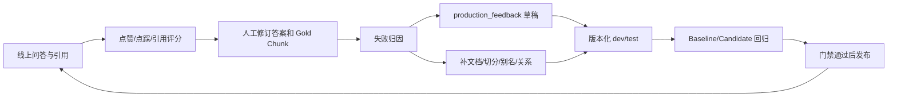

# Evaluation Protocol

## 0. 证据等级

评测声明分为三个等级，不得混用：

1. **方法可复现**：代码、指标口径和命令公开，但没有公开完整运行证据。
2. **结果可审计**：Release 证据包公开原始回答、检索上下文、逐案例指标、实验指纹和 SHA-256，第三方可复算报告并检查完整性。
3. **端到端可重跑**：除证据包外，还必须获得指纹一致的完整语料、模型和供应商版本。受文档再分发权和云端模型漂移影响，本项目当前只声称前两级，不声称任意人都能端到端复制相同数字。

## 1. 数据集生命周期

1. 从已索引语料生成分层候选，状态为 `draft/draft`。
2. 审核人检查问题是否明确、参考答案是否完整、Gold Chunk 是否真正支持答案。
3. 多跳案例至少包含两个 Gold Chunk；跨文档案例至少涉及两个文档；表格案例必须引用表格分块。
4. 审核通过后变为 `active/approved`；test split 同时设为 frozen。
5. test 需要修改时先显式解冻，修改会形成新的数据集版本后再用于正式报告。

本项目 v1 数据集由生成器提出候选，再由 Codex 辅助的单审核者逐条检查问题、答案与 Gold Context，并执行结构和跨 split 泄漏审计。它不是独立多人标注，README 和简历不得声称标注者一致性。

策展与批准命令：

```bash
python backend/scripts/curate_eval_dataset.py --workspace-id 6 --apply --approve
```

禁止把模型回答或当次错误召回来源直接复制为 Gold。

## 2. 数据集配额

| split | single_hop | multi_hop | cross_document | table_numeric | unanswerable | citation | multi_turn | 合计 |
|---|---:|---:|---:|---:|---:|---:|---:|---:|
| dev | 28 | 12 | 10 | 10 | 7 | 7 | 6 | 80 |
| test | 12 | 8 | 5 | 5 | 3 | 3 | 4 | 40 |

生成命令：

```bash
python backend/scripts/generate_eval_candidates.py \
  --base-url http://localhost:8080/api/v1 \
  --workspace-id 6 \
  --dataset-name explorerag_core \
  --dataset-version 1
```

候选导出到 `evaluation/datasets/explorerag_core_v1.candidates.jsonl`。该文件中的 `review_status=draft` 是预期状态。

## 3. 指标口径

- `Recall@20`：Gold Chunk 在 rerank 前向量候选 Top-20 中的覆盖率。
- `Hit@4`：最终 Top-4 是否命中至少一个 Gold Chunk。
- `Recall@4`：最终 Top-4 覆盖 Gold Chunk 的比例。
- `MRR@4`：第一个 Gold Chunk 的倒数排名。
- `nDCG@4`：以 Gold Chunk 为二元相关性的折损累积增益。
- `Citation Validity`：答案中的引用 ID 是否存在于本次来源。
- `Citation Precision/Recall`：被引用的向量来源与人工 Gold Chunk 的精确率/召回率；`kg-fact:*` 引用不混入该分母，由 Graph Traceability/Entity/Relationship 指标单独评估。
- `Faithfulness`：回答声明能否由检索上下文支持。
- `Factual Correctness`：回答覆盖参考答案事实的程度。
- `Answer Relevancy`：回答是否回应问题。
- `Refusal Accuracy`：answer/refuse 预期与系统行为是否一致。
- `Graph Evidence Recall`：人工 Gold Entity 在本次图谱证据实体中的覆盖率。
- `Graph Relationship Recall`：Gold Relationship 的首尾实体是否共同出现在同一条图谱事实证据中。
- `Graph Traceability`：图谱事实中带源文档 ID 的比例。

每个指标同时保存 `value/status/evaluated_count/skipped_count/error_count`。缺少 Gold 或评估器失败不会被记为 0 分，也不会混入平均值。

## 4. 实验指纹

每次运行保存：

- Git commit、branch、dirty 状态
- 数据集案例哈希和数据集 fingerprint
- 文档 content hash/version、chunk 数和语料 fingerprint
- LLM、Embedding、Reranker、KG 模型与解析/切分参数
- Prompt SHA-256
- top-k、prefetch-k、retrieval mode、Reranker/KG 开关
- Python、依赖版本、GPU/CUDA 信息

快照不保存 API Key 或文档全文。

## 4.1 发布证据包

完成 A/B/C/D 后导出 Release 附件：

```bash
python backend/scripts/export_evaluation_report.py \
  --workspace-id 6 \
  --experiment-id <experiment-id> \
  --artifact-zip evaluation/artifacts/explorerag-evaluation-v1.0.0.zip
```

证据包包含 `raw.json`、`report.md`、`manifest.json` 和 `SHA256SUMS`。下载后可离线验证：

```bash
python backend/scripts/verify_evaluation_artifact.py explorerag-evaluation-v1.0.0.zip
```

`manifest.json` 同时记录代码、数据集、语料和实验指纹。如果其中的 commit 不在公开仓库可达，该包只能标为历史归档，不能代表当前代码。

## 5. 正式运行顺序

1. 在 dev 上运行 retrieval 类型 A/B，检查 Gold 标注和 Reranker 排序增益。
2. 在 dev 的关系/多跳子集运行 full 类型 A/C，修复 KG 缺失或噪声。
3. 冻结数据、代码、配置并提交 Git，确保 fingerprint 的 `dirty=false`。
4. 每个 variant 先执行并单独保存一次预热观测；正式 P50/P95 只统计随后稳态查询。固定 case-order seed，并用反向 variant 顺序的 retrieval 复测识别缓存/顺序偏差。
5. 在 test 上串行运行 full A/B/C/D。
6. 检查四组 `experiment_valid=true`、契约一致和 gate 结果。
7. 导出 raw JSON 和 Markdown，再将真实数字写入 README/简历。

新增组件相对 A 的延迟是消融实验要报告的代价，不按同配置发布回归处理；同组件版本升级的 `custom` baseline/candidate 仍执行 25% P95 延迟门禁。

## 6. 反馈飞轮



失败类型：`knowledge_gap`、`retrieval_miss`、`rerank_error`、`graph_miss`、`graph_noise`、`generation_error`、`citation_error`、`unanswerable_error`。
